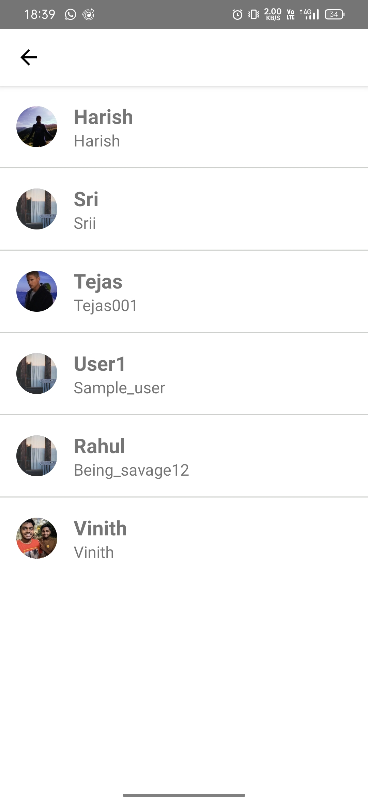
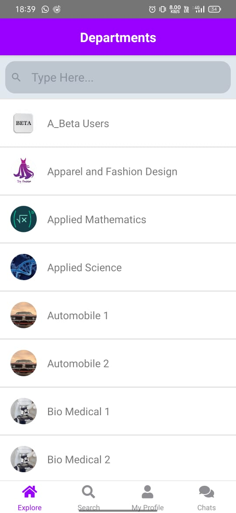
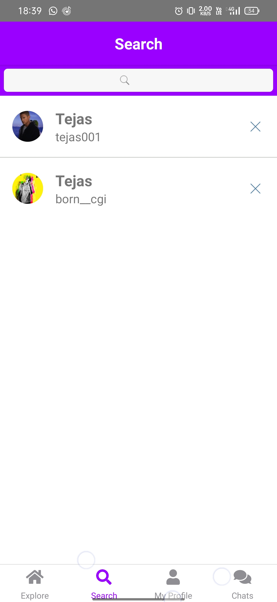
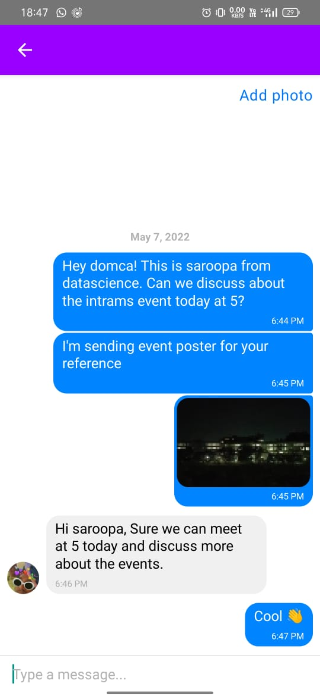
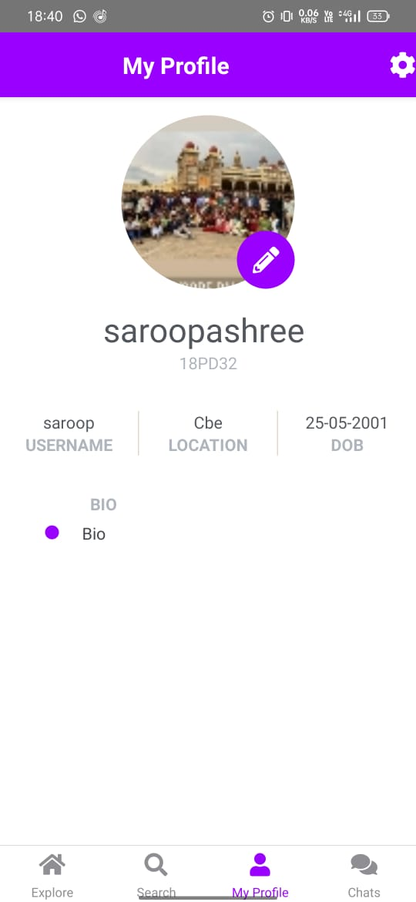
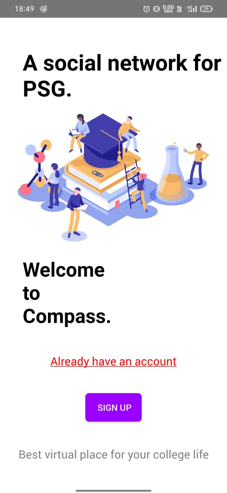
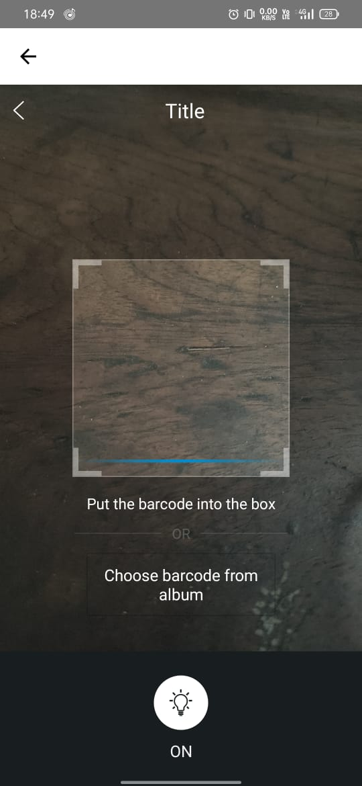

<div id="top"></div>

<!-- PROJECT LOGO -->
<br />
<div align="center">
  <a href="https://github.com/tejase/SNC-psghackathon">
    
  </a>

<h3 align="center">Project-SNC</h3>

  <p align="center">
    <br />
    <a href="https://drive.google.com/file/d/1iY9qw5--nalj4BO2VlTL9DiP7zEjwarO/view?usp=sharing"><strong>Download APK</strong></a>
    <br />
    <br />
    <a href="https://youtu.be/kkDelZyvhFU">View Demo</a>
  </p>
</div>

<!-- TABLE OF CONTENTS -->
<details>
  <summary>Table of Contents</summary>
  <ol>
    <li>
      <a href="#about-the-project">About The Project</a>
      <ul>
        <li><a href="#built-with">Built With</a></li>
      </ul>
    </li>
    <li>
      <a href="#getting-started">Getting Started</a>
      <ul>
        <li><a href="#prerequisites">Prerequisites</a></li>
        <li><a href="#installation">Installation</a></li>
      </ul>
    </li>
    <li><a href="#usage">Usage</a></li>
    <li><a href="#roadmap">Roadmap</a></li>
  </ol>
</details>

<!-- ABOUT THE PROJECT -->

## About The Project

Project SNC is an application to have a platform for students in a college to connect. 🚀

<p align="right">(<a href="#top">back to top</a>)</p>

### Built With

- [React Native](https://reactnative.dev/)
- [Firestore](https://firebase.google.com/products/firestore)
- [Firebase storage](https://firebase.google.com/products/storage)
- [Google cloud platform](https://cloud.google.com/gcp/)

<p align="right">(<a href="#top">back to top</a>)</p>

<!-- GETTING STARTED -->
## Demo
[](https://youtu.be/kkDelZyvhFU)

## Getting Started

To get a local copy up and running follow these simple steps.

### Prerequisites

- python 3.6 +
- JAVA 8 or ll
- React native CLI
- Node.js

### Installation

1. Clone the repo

   ```sh
   git clone https://github.com/tejase/SNC-psghackathon
   ```

2. Install the required modules
   ```sh
   npm install
   ```
3. Run the application
   ```sh
   npx react-native run-android
   ```

<p align="right">(<a href="#top">back to top</a>)</p>

<!-- USAGE EXAMPLES -->

## Usage

Project SNC is a platform for students in a college to connect and grow 🚀

As of now we still use old school methods like whatsapp or email for any type of communication within college. The basic aim of this project is to make sure, anyone in the college can communicate with any other person within the college with least effort.

Let's take an example scenario. Say you are an M.Sc. 2nd year Software systems student ,a college level culturals like intrams is happening and you need to talk about the same to a 4th year mechanical student. (you just know his name, year and department). You can just open the app, select the department and year, boom you get list of all the corresponding students. You can select the person you wanted to talk and have a chat with them. You can share the event poster too! ( Yes! we support sending images as messages too :) )

Now lets talk about the signup procedure. For an application specific to an organaisation like this, the most imporant thing is authentication. i.e we need to make sure only students studying in PSG Tech can have an account in the app. To tackle this situation we scan the ID-card of the student while he/she signs up for the first time. Also from the ID card we extract the year, section and department details of the student thus properly classifying them. This reduces errors too, as users knowingly/unknowingly might give wrong department data.

Once the user has signedup/logged in, he enters the homepage of the application which displays the list of departments. Also each user has a public profile which contains basic info and a profile picture. User can find another student either navigating through department or searching them through the search option. After finding a student profile, user can open the chat window in a single click.

The chat system is realtime, and currently supports sending text and image messages.

The user can also edit their profile details any time.

Apart from these some options like requesting new feature, ratings are also included, as they can be eventually added in the application.

In future this application can further be expanded. It can be integrated with college clubs to get information about events, news and auditions. Group chats among each class, batch, department can be generated, where students can discuss stuffs. Also question paper sharing can be introduced. Also two step authentication with the official email adress can be introduced further improving the security of the application. ( Reduces fake accounts ).

<p align="right">(<a href="#top">back to top</a>)</p>

<!-- Screen shots -->

## ScreenShots

<p float="center">










</div>
</p>

<!-- ROADMAP -->

## Roadmap

- [ ] User authentication
  - [ ] ID card scanner
  - [ ] Session management
  - [ ] Login/ Signup
- [ ] Explore screen
- [ ] Departments
- [ ] Chats
- [ ] Profile
- [ ] Settings
- [ ] Database implementation
  - [ ] Firestore for storing all user and department data
  - [ ] Firebase storage for storing profile pictures and images in chat
- [ ] Google cloud platform ( Chat system )
  - [ ] For dynamically updating chatlist and chats
  - [ ] Push notifications
- [ ] Deploy the application
  - [ ] Debug-apk link provided in the description

<p align="right">(<a href="#top">back to top</a>)</p>
